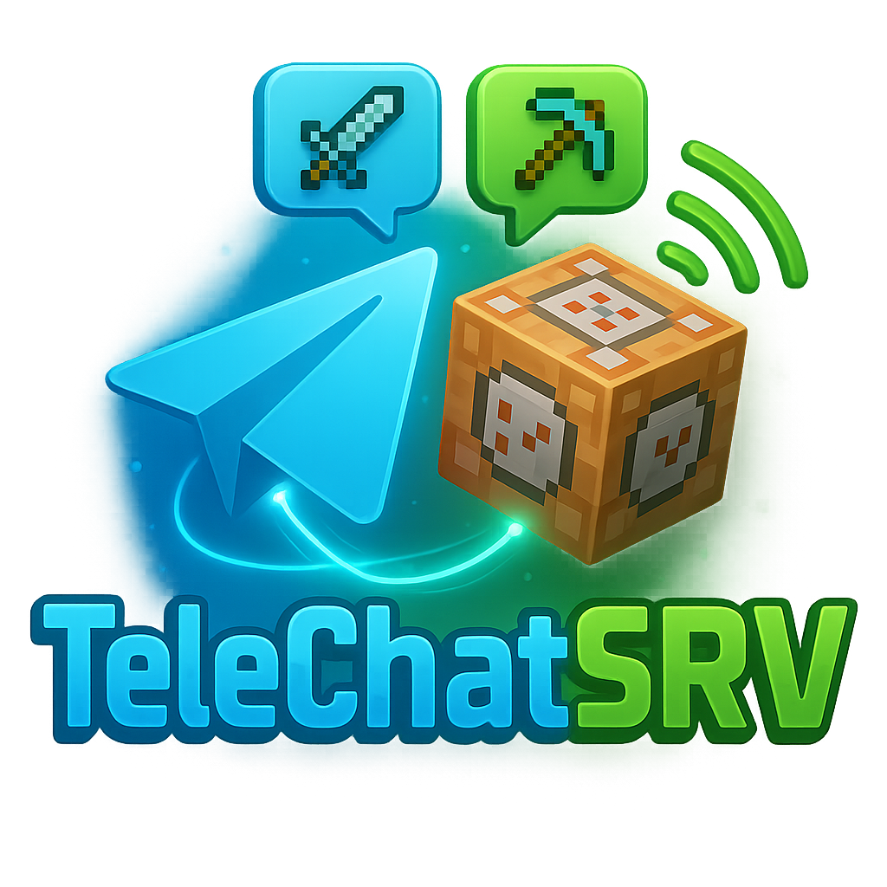
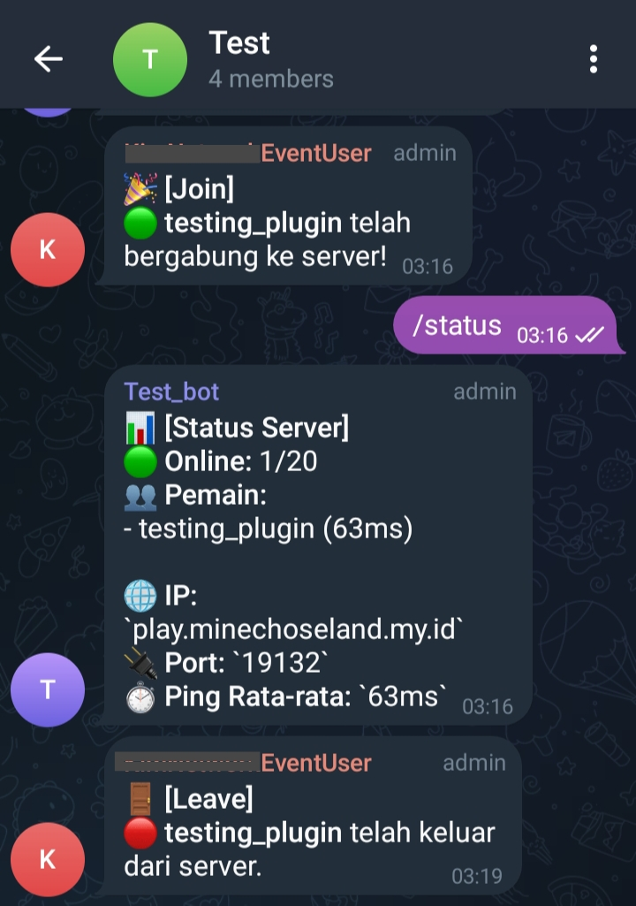

<p align="center">
  
</p>

<h1 align="center">TeleChatSRV</h1>

<p align="center">
  
  
  
</p>

<p align="center">
  Plugin integrasi <strong>Minecraft + Telegram</strong> untuk monitoring real-time aktivitas server.<br/>
  Awasi pemain, deteksi kecurangan, dan dapatkan notifikasi langsung ke Telegram Anda.
</p>

<p align="center">
  <a href="#fitur-utama">Fitur</a> •
  <a href="#mengapa-memilih-telechatsrv">Kenapa TeleChatSRV?</a> •
  <a href="#contoh-notifikasi">Notifikasi</a> •
  <a href="#konfigurasi">Cara Konfigurasi</a> •
  <a href="#contoh-config">Contoh Config</a>
</p>

---

## Apa Itu TeleChatSRV?

**TeleChatSRV** adalah plugin untuk Spigot/Bukkit/Paper yang menghubungkan server Minecraft Anda dengan **Bot Telegram** secara langsung. Cocok untuk para admin yang ingin:

- Memantau server **dari mana saja**
- Mendeteksi pemain mencurigakan (seperti penggunaan Xray)
- Mendapatkan notifikasi real-time langsung ke Telegram

---

## Mengapa Memilih TeleChatSRV?

- Tidak memerlukan backend — cukup masukkan token & chat ID
- Notifikasi real-time tanpa delay
- Konfigurasi fleksibel & modular lewat `config.yml`
- Cocok untuk server publik, komunitas, hingga personal
- Bisa dikontrol dari Telegram (status, pemain, dll)

---

## Fitur Utama

- **Notifikasi Join/Quit**
  - Pemberitahuan saat pemain masuk dan keluar dari server

- **Notifikasi Kematian & Pembunuhan**
  - Kirim pesan ketika ada pemain yang membunuh atau terbunuh

- **Deteksi Xray Otomatis**
  - Notifikasi saat pemain menghancurkan block berharga
  - Block yang terdeteksi dapat dikustomisasi di `config.yml`

- **Kontrol Bot 2 (CommandBot)**
  - Kirim perintah /status, /players, /ip langsung dari Telegram
  - Dapatkan info server real-time dari luar

---

## Contoh Notifikasi

- `[JOIN] Naufal90 baru saja masuk ke server.`
- `[KILL] Naufal90 membunuh Steve.`
- `[XRAY?] Naufal90 menghancurkan DIAMOND_ORE di X:120 Y:11 Z:-45.`



---

## Konfigurasi

1. Buat Bot Telegram dengan [@BotFather](https://t.me/BotFather)
2. Salin token dan isi di file `config.yml`
3. Dapatkan `chat_id` Telegram Anda (gunakan bot seperti [@userinfobot](https://t.me/userinfobot))
4. Jalankan server Anda dan nikmati notifikasi otomatis ke Telegram!

---

## Contoh Config (`config.yml`)

```yaml
notifyBot:
  token: "ISI_TOKEN_BOT_1"
  chat_id: "CHAT_ID_BOT_1"

controlBot:
  token: "ISI_TOKEN_BOT_2"
  chat_id: "CHAT_ID_BOT_2"

block_notify_filter:
  DIAMOND_ORE: true
  EMERALD_ORE: true

count_block_destroy_xray:
  DIAMOND_ORE: 16
  EMERALD_ORE: 12
```

---

## Siap Digunakan!

Unduh versi terbaru dari [Releases](https://github.com/Naufal90/TeleChatSRV/releases)  
Jangan lupa beri ⭐ jika plugin ini membantumu!

---
